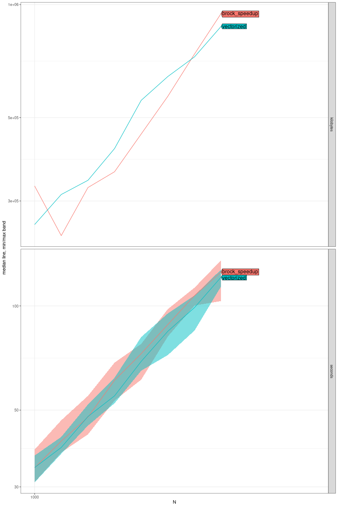
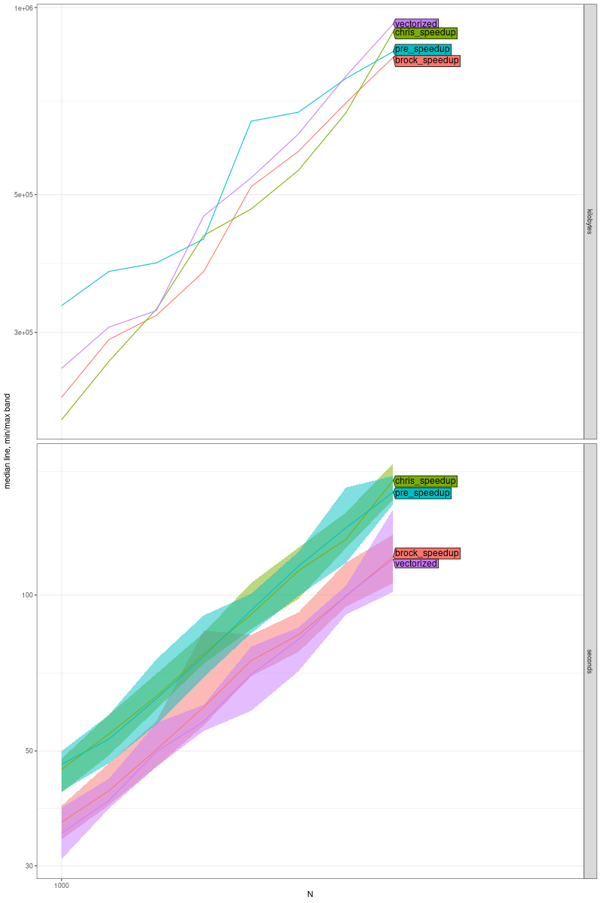

# CTMM Performance Improvement Projecta (2024)

These are some scripts I used in an attempt to profile, and improve runtime of Chris Flemming's [ctmm package](https://github.com/ctmm-initiative/ctmm). These scripts are not intended for re-use, but might be a helpful reference for similar projects. (Improving performance of an existing R statistical package.)

This work was conducted at and therefore funded by the Max Planck Institute of Animal Behavior.

# Lab Notebook

## TODO
- Look for vectorization opportunities in Kalman
- Go back to try to map ctmm kalman filter function to other kalman filter libraries (read the paper carefully). Validate the idea that this would cause issues with Inf and NaNs.
- Try nvblass on version with bigger matrices.
- Try to figure out why `1.R` sometimes needs to be 

## Testing toolbox
- profvis []

## 20240717 - 20240726

Note: Langevin function and langevin function are two different functions. Langevin calls langevin.

During this time, I focused on trying to optimize the langevin function. One of the first things I did was refactor to make a version of langevin that takes all parameters explicitly instead of via ctmm object.  [R/bench_lib](R/bench_lib.R) contains the original `langevin` code from the package with this reparameterization. This file is sourced in multiple other scripts as a baseline. [R/originalLangevin.R](R/originalLangevin.R) is the equivalent for the `Langevin` function

### Functional regression testing strategies (making sure the code still does the same thing it did before)

- **hacky: langevin inputs csv/data table** To get realistic input values, I manually edited the ctmm source code to store the inputs and outputs in a global variable (with `<<-`), and ran a long script. I also had a global iterator variable and made the code stop after a few iterations. Then, I saved the results in a data table. I also added some manually in order to make sure I my tests were covering every line in the langevin function.
    - Changes to the ctmm package to generate this object aren't saved.
    - [Code to reshape inputs into csv](R/lange_extract_inputs.R)
    - [Code to shape back into arguments and run](R/langevin_benchmark.R#L697-L707)
    - [Code to check coverage](R/lange_fuctional_test.R)
- **nicish, but scary: Langevin monkey patching** To make this process a bit quicker and systematic to apply to arbitrary functions, I wrote a script that replaces any function you specify within its packages namespace with a version that does the same thing, but saves the inputs and outputs to an environment that can be accessed later. Result is a list with two elements each of which is a sublist. One sublist has the inputs and the other has the return values. I would save these two sublists rds, rda or RData format, and then rehydrate to run tests. If the fuction is called few enough times, you can save the input and results of every call in a longer routine this way, thus allowing you to validate that you are not impacting the functionality of your focal function within this routine whatsoever. 
    - Code to apply the monkey patch is not yet released, plan to release soon in a separate repo.
    - [Filter](R/testgen_Langevin.R) I used this code to remove some parts of CTMM object that are minimal changes on the input data to save space.
    - [Using Generated Testcases](R/bench_Langevin.R#L42-L64)
    - This is how I generated the `.rda` file for [this PR](https://github.com/ctmm-initiative/ctmm/pull/60)
    - Precursor: Method in between the above bullet and this one. Here I did modify the code. [Precursor generating data](R/hacky_lange_testgen.R), [Precursor using data](R/hacky_Lange_testscript.R)
- **failed attempt: dump/dput** I tried to use `dump` and/or `dput` to save CTMM objects as R code that could be rehydrated by running it. However, this didn't work. For some reason, the rehydrated objects lacked names so I would have to save objects either as `.rds` or in a custom plaintext format (the csv mentioned above).

## Performance testing

Used microbenchechmark throughout to compare different versions of the same function.

As a final check, I used `atime` to compare multiple versions doing a full model fit to verify that "micro" improvements translated into macro.
- [atime script calling ctmm.fit directly](R/atime_buff_full.R)
- [atime script calling ctmm.select](R/atime_buff_select.R)


I also started the process of creating similar checks with the wolf dataset ([here](R/generate_testdata_wolf.R)), but it seemed to be covering similar lines of code within the parts of the package that I was focusing on.

### Refactors attempted on langevin

- **One Big if....else...** The was less of an attempt to optimize, and more of an attempt to make the logic more clear/understand it better...and possibly see if these `if(...){...}else{...}` could in theory be vectorized into `ifelse` or similar.
    - **Code** [R/langevin_benchmark.R](R/langevin_benchmark.R) `big_switch` function.
    - **Results**  As expected, this made performance slightly worse because more checks were taking placing. Doing this refactor did help me understand the logic better.
- **Big if...if... with early return** Same as above, but this time put a return statement inside each `if` so that once the correct condition is found, the rest are not checked. This would definitely be faster than the above big if else, but not obviously faster than the original since the the original avoids some unnecessary evalutations with nested if else.
    - **Code** [R/langevin_benchmark.R Line 307](R/langevin_benchmark.R#L307) `pure_r_optim` function.
    - **Results** Not too different from above outcome. Worse than the original. 
- **Factory Method** 
    - **Background** Within each Langevin function in the stationary case, the CTMM object doesn't change. In the stationary case, within each Langevin call, the only argument that changes is the dt argument. Out of all the quantities that are checked to deterimine which method to follow, the only ones that depend on dt are `nudt>0.8813736` and `dt<Inf`. Therefore, for each CTMM objection, we could construct a custom langevin function that depends only on these two quantities. This function would only be selected once per Langevin call (in the stationary case). That way we avoid repeatedly evaluating the same ctmm parameters.
    - **Code** [R/langevin_benchmark.R Line 436](R/langevin_benchmark.R#L436)
    - **Results** Testing the langevin function in isolation with different params, it (expectedly) performed similarly to previous two attempts, worse than orginal. Needed to evaluate in context of a full Langevin call.

At this point, I wanted to see if profiling my refactors could give insight into other speedup ideas.
- [Code to generate profile](R/langevin_profile.R)
- [Resulting profile](profiles/profile_refactored.html)

### Sinch Detour

Based on the profile, sinch stood out as an place to optimize.
- [Sinch benchmarks](R/bench_sinch.R)
- Added this change to existing [exp2 PR](https://github.com/ctmm-initiative/ctmm/pull/58)

### Optimizing accross multiple langevin runs

[This script](R/vectorize_bench.R) has mini-Langevin functions and was used to run multiple versions of langevin function against each other and reshape the outputs so that they would match in structure even if calls did match perfectly. It sources the candidate functions.

- **Simplifying Existing Loops** Reading through the code, it seemed like existing loops could be simplified. Modest, but clear performance improvement was achieved here. [PR here](https://github.com/ctmm-initiative/ctmm/pull/60)
- **Factory Method** Tried to validate the idea of a "function picker" described above. Then I realized each of these functions could be vectorized. [langevin equivalent](R/vectorize_lib.R#L26-L247) (langevin_fn_factory), [Langevin equivalent](R/vectorize_bench.R#L26-L44) (vectorized)
- **Check without factory** Realized it was likely the vectorization (dt as a vector instead of a scalar taken as an argument) aspect and not factory function aspect that was causing the speedup. Because the custom function is now getting called once instead of in a loop, evaluating tau, K, etc. became a one-time cost. I validated this by comparing against the big_switch from above.
   - [langevin equivalent](R/vectorize_lib.R#L249-#L464) (no_factory), [Langevin equivalent](R/vectorize_bench.R#L7-L24) (vectorized_no_factory)
- **Vectorizing (or rather matrixizing) original function** Based on this theory, refactoring to make a function that only depends on dt seemed unnecessary, so I went back to the original version and modified it to take dt vectors without changing the high level structure.
   - [langevin equivalent](R/vectorize_lib.R#L465-L643) (vect_from_orig), [Langevin equivalent](vectorize_bench.R#L4) (v_rom_o)

Results

```
Unit: milliseconds
                               expr      min       lq     mean   median
          pm_Langevin(orig_wrapped) 3.610253 3.681173 3.792307 3.736191
            pm_Langevin(vectorized) 1.647363 1.763114 1.827580 1.806475
 pm_Langevin(vectorized_no_factory) 1.655294 1.750106 1.954150 1.802874
              pm_Langevin(v_from_o) 1.014779 1.100715 1.149552 1.129899
       uq      max neval cld
 3.829225 4.648289   100 a  
 1.873582 2.145873   100  b 
 1.907630 8.049493   100  b 
 1.189826 1.616803   100   c
 ```

 The vectorized version of the original is the clear winner. Original takes ~3x as long on this dataset.
 
 However.....

 Running atime, it doesn't look like it made much of a dent in the overall runtime.
 
  
 
 Here
 - "pre-speedup" is [this commit](https://github.com/ctmm-initiative/ctmm/commit/66d1f5180323ae5502417c908e4e686ba65d2334)
 - "chris speedup" is [this commit](https://github.com/ctmm-initiative/ctmm/commit/37a1aa480ab326f524e4314731cbfb2107182180)
 - "brock speedup" is with the simplified for loop in [this PR](https://github.com/ctmm-initiative/ctmm/pull/60)
 - "vectorized" is the vectorized/matrixed version of the original mentioned above

 My suspicion (to be validated) is that this is because with the "brock speedup" above, there simply aren't very many elements in the for loop to start with so not much time that can be gained by removing it.


## 20240701

### memoise attempt

Tried a quick fix for calling the langevin function multiple times with the same argument. More details in the [PR here](https://github.com/ctmm-initiative/ctmm/pull/59).

- [benchmark memoise version](R/memoise_bench.R)
- [profile data](profiles/profile_memoise.html)

## 29062024

Sometime before this, I worked throught the vignettes in the package.

### nvblas attempt

I have a GPU machine, so I tried running CTMM with [nvblas](https://docs.nvidia.com/cuda/nvblas/index.html). I ran a small test script [see bench_gpu.R](R/bench_gpu.R) and benchmarked using [hyperfine](https://github.com/sharkdp/hyperfine). I was able to get R to use nvblas. I could see the process on `nvtop`. However, this made the script slower, not faster. Talking to Chris later, his suspicion was that this package is not acting on big enough matrices to make the GPU trade off worth it. So far, I haven't found a case (even outside of ctmm) where R+nvblas does better than openblas with my setup. Might try later to contrive some example to make this the case.

### profiling 

Profiled some of code from one of the ctmm vignettes using visprof.

- [Code here](R/profile_buf.R)
- [Results here](profiles/profile_all3.html). 

High level, Kalman filter portion is where all the CPU time is going. There are some small functions (notably sinch() and pd solvers) that can likely be optimized to save time.

I though it might be worth while to try popping in an existing kalman filter function. On my own I wasn't able to figure out how to map the code (and didn't find the right paper supplement). [Attempt here](R/kalman_mapping.R)

### dexp optimization attempt

Targetted the dexp1 and dexp2 functions for improvements.

- [Benchmarks Here](R/bench_dexp.R)
- [Resulting PR Here](https://github.com/ctmm-initiative/ctmm/pull/58#issue-2380386672) (with the outputs from above script printed)

Related, but less useful scripts:
- [Early attempts to use rcpp](R/cpp_dexp.R)
- [Tracking down a bug in my initial PR](R/dexp_find_my_bug.R)